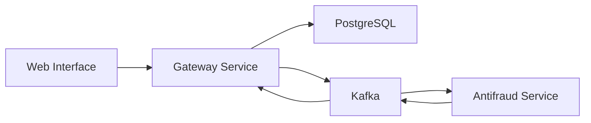

# FC Pay - Payment Gateway System

[](https://golang.org) [](https://nextjs.org) [](https://nestjs.com) [](https://kafka.apache.org) [](https://www.postgresql.org) [](https://opensource.org/licenses/MIT)

A comprehensive payment gateway system built with microservices architecture, focusing on modern development practices and distributed systems.

## Table of Contents

- [Project Overview](#project-overview)
- [System Architecture](#system-architecture)
- [Components](#components)
- [Getting Started](#getting-started)
- [Development Setup](#development-setup)
- [Study Focus](#study-focus)
- [License](#license)

## Project Overview

This project is a study implementation of a payment gateway system, designed to explore and understand modern microservices architecture and distributed systems. It consists of three main components working together to provide a complete payment processing solution.

## System Architecture

### Tech Stack

| Component | Technology | Purpose |
|-----------|------------|---------|
| Frontend | Next.js 14 | Web interface |
| Gateway | Go 1.21 | Payment processing |
| Antifraud | NestJS | Fraud detection |
| Message Queue | Kafka | Event-driven communication |
| Database | PostgreSQL 16 | Data persistence |

### System Components



## Components

| Component | Description | Repository |
|-----------|-------------|------------|
| [Web Interface](https://github.com/brunownk/fc-pay-web) | Next.js frontend for payment management | [fc-pay-web](https://github.com/brunownk/fc-pay-web) |
| [Payment Gateway](https://github.com/brunownk/fc-pay-gateway) | Go backend for payment processing | [fc-pay-gateway](https://github.com/brunownk/fc-pay-gateway) |
| [Fraud Detection](https://github.com/brunownk/fc-pay-antifraud) | NestJS service for basic fraud analysis | [fc-pay-antifraud](https://github.com/brunownk/fc-pay-antifraud) |

## Getting Started

### Prerequisites

| Requirement | Version | Purpose |
|-------------|---------|---------|
| Go | 1.21+ | Gateway Service |
| Node.js | 18.17+ | Web & Antifraud Services |
| Docker | Latest | Containerization |
| Docker Compose | Latest | Service Orchestration |

### Installation Steps

1. **Clone the repository with submodules**
   ```bash
   git clone --recursive git@github.com:brunownk/fc-pay.git
   cd fc-pay
   ```

2. **Start the services in order**

   > ⚠️ **Important**: The services must be started in the following order to ensure proper network and dependency initialization.

   a. **Start the Gateway service first** (creates required network and Kafka broker)
   ```bash
   cd fc-pay-gateway
   cp .env.example .env
   docker-compose up -d
   ```

   b. **Start the Antifraud service** (depends on Kafka from Gateway)
   ```bash
   cd ../fc-pay-antifraud
   cp .env.example .env
   docker-compose up -d
   ```

   c. **Start the Web interface** (depends on Gateway API)
   ```bash
   cd ../fc-pay-web
   cp .env.example .env
   docker-compose up -d
   ```

3. **Verify all services are running**
   ```bash
   # Check gateway service
   curl http://localhost:8080/health

   # Check antifraud service
   curl http://localhost:3001/health

   # Check web interface
   curl http://localhost:3000
   ```

4. **Access the application**
   - Web Interface: http://localhost:3000
   - Gateway API: http://localhost:8080
   - Antifraud Service: http://localhost:3001

## Development Setup

### Docker Network Configuration

The system uses a shared Docker network named `fc-pay-network` for inter-service communication:

- Gateway API: `http://app:8080`
- Antifraud API: `http://nestjs:3001`
- Web Interface: `http://localhost:3000`

### Service Dependencies

| Service | Dependencies |
|---------|--------------|
| Gateway | PostgreSQL, Kafka |
| Antifraud | PostgreSQL, Kafka |
| Web | Gateway Service |

### Health Checks

Each service provides health check endpoints:

1. **Gateway Service**
   ```bash
   curl http://localhost:8080/health
   ```

2. **Antifraud Service**
   ```bash
   curl http://localhost:3001/health
   ```

3. **Web Interface**
   ```bash
   curl http://localhost:3000/api/health
   ```

## Study Focus

| Topic | Description | Implementation |
|-------|-------------|----------------|
| 🏗️ Microservices | Architecture patterns and best practices | Three independent services |
| 📨 Event-Driven | Kafka integration and event processing | Asynchronous communication |
| 🔐 Authentication | API key-based security | Secure payment processing |
| 🗄️ Database | PostgreSQL operations and data modeling | Transaction management |
| 🐳 Docker | Containerization and orchestration | Service isolation |
| 🔄 CI/CD | Continuous integration and deployment | Automated testing |

## License

This project is licensed under the MIT License - see the [LICENSE](LICENSE) file for details.